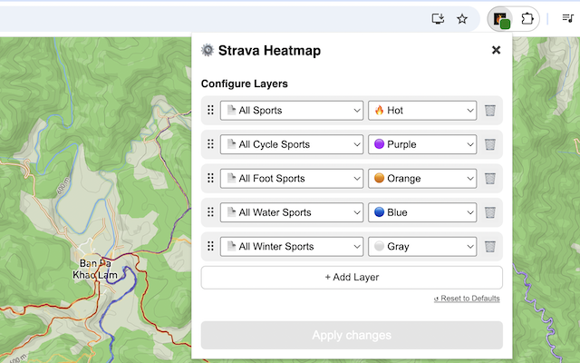

# Strava Heatmap extension

This browser extension seamlessly integrates the [Strava Global Heatmap](https://www.strava.com/maps/global-heatmap) into popular mapping editors, including the OpenStreetMap [iD editor](https://www.openstreetmap.org/edit?editor=id) and [GPX Studio](https://gpx.studio/app), enhancing your mapping and route analysis capabilities.

&nbsp;

## Pre-requisites

### Strava account

If you don’t already have a Strava account, you’ll need to create one (free) to use the Strava Heatmap.

1. Go to https://www.strava.com/register/free
2. Sign up using Google, Apple, or your email

## Installation

### Chrome

1. Open the [Chrome extension page](https://chrome.google.com/webstore/detail/eglbcifjafncknmpmnelckombmgddlco) for the extension.
2. Click `Add to Chrome`.
3. Confirm permissions by selecting `Add extension`.
4. Chrome will briefly display a popup and show the new extension icon in the top-right toolbar.
5. Right-click the extension icon and choose `Pin` to keep it visible.
6. Alternatively, open the puzzle-piece Extensions menu and click the 📌 next to Strava Heatmap extension.

### Firefox

1. Open the [Firefox add-on](https://addons.mozilla.org/en-US/firefox/addon/strava-heatmap/) for the extension.
2. Click `Add to Firefox`.
3. Confirm permissions by selecting `Add`.
4. Chrome will briefly display a popup and show the new extension icon in the top-right toolbar.
5. Make sure `Pin extension to toolbar` is selected and click `OK`.
6. Alternatively, right-click the extension icon and choose `Pin` to keep it visible.

### Versions

See the [Changelog](./CHANGELOG.md) for details.

### Instructions

## OpenStreetMap iD editor

To enable the Strava Heatmap in the iD editor:

1. Open the iD editor: https://www.openstreetmap.org/edit?editor=id
2. Press B or click Background settings, then scroll to Overlays.
3. Select a Strava Heatmap overlay from the list.
4. If you see the message "Click the Strava Heatmap extension icon to log into Strava…", click the red extension icon to authenticate. If you don’t have an account, you can sign up at: https://www.strava.com/register/free
5. After logging in, use the green extension icon to configure heatmap layers — choose activity type, color, and manage layer order or deletion.
6. In the editor, press Shift + Q to toggle the heatmap, and Shift + W to toggle data visibility.

---

### GPX.studio editor

To enable the Strava Heatmap in GPX.studio:

1. Open GPX.studio: https://gpx.studio/app
2. Hover over the layers menu icon then scroll to Overlays.
3. Choose a Strava Heatmap overlay from the list.
4. If you see the message "Click the Strava Heatmap extension icon to log into Strava…", click the red extension icon to authenticate. If needed, register here: https://www.strava.com/register/free
5. Once logged in, use the green extension icon to configure, reorder, or delete heatmap layers by activity and color.

### Troubleshooting

**Q: “Click the Strava Heatmap extension icon to log into Strava and enable the heatmap.” — What does this mean?**  
**A:** This message appears if you're not logged in to Strava AND haven’t visited the [Strava Global Heatmap](https://www.strava.com/heatmap). Just click the extension icon to sign in and authorize access.

### Feature and Bug Requests

Submit issues and feature requests in the [Issues](https://github.com/julcnx/strava-heatmap-extension/issues) section above.

## Extension Background

Previously, accessing Strava heatmap in OpenStreetMap iD editor required a tedious process of extracting Strava website cookies and generating a temporary URL that would expire after a week.

The [JOSM Strava Heatmap Extension](https://github.com/zekefarwell/josm-strava-heatmap) simplified this process, but due to the lack of support for custom overlays in the iD editor, users could only add the URL as a custom background.

With this extension, you can now automatically access all Strava activities as Heatmap overlays, eliminating the need for manual URL management.

To learn more about using the Strava Heatmap in OpenStreetMap, visit the [Strava wiki](https://wiki.openstreetmap.org/wiki/Strava).

### Support for Other Editors

Browse existing requests or open a new one here: https://github.com/julcnx/strava-heatmap-extension/issues
